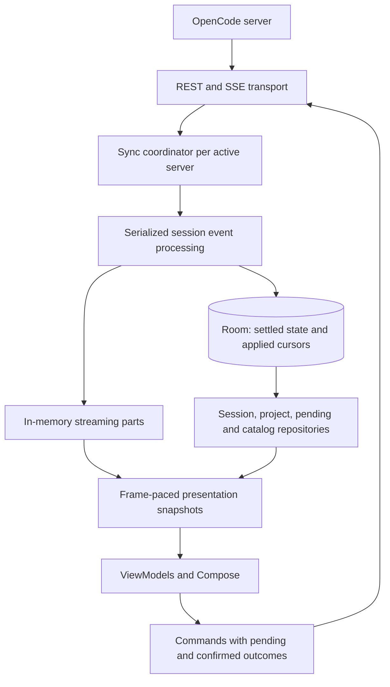

# FlowPilot implementation and architecture review

Follow-up: [architecture and reliability implementation](reliability-implementation.md). Findings below describe the original audited revision.

Reviewed 2026-09-27 against commit `ee95a4f`, [build plan](build-plan.md), and [design phases](design-system/project/guidelines/50-phases.md).

The app has most of the visible Phase 1 workflows, but Phase 1's reliability acceptance criteria are not yet satisfied by the implementation. Prioritize synchronization, durable storage, and streaming performance before M5–M8. This repository contains the Android client; the OpenCode server implementation is not present. “Backend” recommendations here concern the client's transport, data, and synchronization layers.

This is a source review, with local validation results below. Performance risks are inferred from code, not measured phone latency or frame-rate results. Existing API design notes are treated as the project's contract; compatibility with a currently running server was not verified.

## What is implemented from the plan

“Present” means an implementation exists, not that its milestone acceptance test has passed.

| Milestone | Present | Missing or materially different | Assessment |
| --- | --- | --- | --- |
| M0: foundations | `:app` and JVM `:core`; typed DTOs; lenient JSON; reducer/parser tests; one recorded failed-turn SSE fixture; CI core tests and APK build; manual release workflow | CI lint, OpenAPI drift check, broad API contract fixtures, screenshot/UI tests, fixture recorder, fault-injection coverage | Partial |
| M1: connect + Home | QR/manual pairing; encrypted secrets; multiple saved servers with one active connection; version check at pairing; connection status; title search; session paging; projects tab; cached initial Home | Room; persistent older pages; Home is grouped by attention/pins/date rather than by project; no demonstrated under-10-second pairing/offline acceptance run | Broad feature coverage, incomplete data guarantees |
| M2: chat + streaming | REST history paging; live text/reasoning/tools; work groups; basic inline diffs and outputs; retry/error states; latest-page refresh after reconnect | Durable replay integration; sequence deduplication; frame-paced buffered text; incremental Markdown; child-session navigation; tool image viewer; specialized web results/browser views; live shell output | Partial; most important reliability gap |
| M3: send + projects | First-send session creation; send/stop; steer/queue; cancel and edit-via-cancel queued items; project picker; folder browsing/creation/git init/clone; scratch folder; model/agent selection; visibility and variants | Branch/worktree creation; project settings; folder search; queue edit has cancellation failure race; defaults differ: 3 recent models, not 5, and enabled/nondeprecated models instead of a six-month release filter | Core flows present; robustness and scope gaps |
| M4: human in loop | Permission decisions; forms; global Inbox; rename/delete; local pin setting | Runtime permission presets; archive UI/write route; server metadata pins; fork; undo/revert; compact action; deny-with-message | Phase 1 approval/form slice present; remainder largely absent |
| M5: power tools | Inline diff component and output previews are reusable foundations | Commands, mentions, skills picker, attachments UI, dictation, workspace file viewer, full Review/line comments, git controls | Largely absent |
| M6: background/terminal/devices | Reconnect trigger on foreground entry | Foreground service, notification actions/reply, PTY/WebSocket terminal, adb device view/input | Absent |
| M7: polish/platform | Theme settings, model settings, crash recording/display, last-chat resume, drafts | Adaptive multi-pane layout, widgets, tile, share target, shortcuts, usage screen, providers/MCP/plugins management, snooze, event debug bundle, measured accessibility/performance acceptance, Play internal AAB workflow | A few slices present |
| M8: companion devices | Design documents | Companion plugin, RPC/video transport, interactive device tab, PiP, web preview tunnel | Absent |

Phase 1 should remain **in progress**. Phase 2 has small reusable pieces; Phase 3 is design-only. Assigning a completion percentage would hide the weight of the unimplemented synchronization work.

Extra-feature status: offline reading and drafts are partial; local pins and per-turn token/cost display exist. Tags, timeline scrubber, context-window meter, session-link navigation, provider login, MCP management, and the platform extras remain unimplemented. A drawable, DTO field, or component specification does not establish a working feature.

## Highest-priority findings

### 1. P1 — A REST refresh can erase newer streamed chat state

Evidence: `app/.../ui/chat/ChatViewModel.kt:130–160`; `core/.../chat/ChatReducer.kt:99–106`.

`load()` starts a new job each time, fetches messages, then waits for permissions, forms, inbox, and active status before applying those messages. Meanwhile `follow()` continues reducing live events. `mergeLatest()` replaces the current window with the older REST result, retaining only entries older than the fetched window and pending user entries. A newly streamed assistant entry can disappear; an existing entry can revert to earlier text. Overlapping loads can also complete out of order. Initial cache loading can overwrite entries already received from the stream.

Reproduction sequence: REST captures assistant text `A`; SSE changes it to `AB` and adds another assistant step; an auxiliary endpoint is slow; REST finally merges the old page, reverting `AB` and dropping the newer step. No subsequent event is guaranteed to repair a finished turn.

Fix: give each session one serialized synchronization owner. Reconcile snapshots against events received during the fetch, using a tested snapshot/log boundary. Use generation checks and a single in-flight refresh with a pending-refresh flag. Render the transcript before optional auxiliary requests finish. A mutex around refresh alone does not solve stale snapshots overwriting live events.

Acceptance: delayed snapshots and out-of-order refresh completion never remove newer text, messages, permission changes, or terminal execution state.

### 2. P1 — Reconnect recovery is a newest-page refetch, not durable replay

Evidence: `core/.../api/EventStream.kt:85–88`; `ChatViewModel.kt:105–125`; `ChatReducer.kt:131–150,216`; `ChatModel.kt:20`.

`sessionLog()` exists but has no app caller. `lastSeq` is only held in memory and updated with `maxOf`; it is neither persisted nor used to reject already-applied events. Chat reconnect fetches only 40 newest messages. If more than that arrived during an outage, older cached entries can remain separated from the new page by a gap; `mergeLatest()` may preserve the old pagination cursor, making that gap hard to retrieve through normal paging.

Connecting the existing log helper directly would introduce additional problems: it retries once with the original cursor, and the reducer appends some markers unconditionally. Replayed interruption/compaction events can duplicate markers, and older events can regress execution state. Its broad “events are applied idempotently” comment is stronger than the implementation.

Fix: persist a **successfully applied** per-session durable cursor with the corresponding state; deduplicate ordered durable events; define ownership when global and session streams overlap; retain live ephemeral deltas separately. On reconnect, catch up before declaring the session synchronized. If the experimental log is unavailable or its cursor expired, explicitly reconcile message pages through the gap. Verify actual server sequence semantics before treating a numeric jump as missing data.

Acceptance: airplane mode over more than one message page; repeated replay; interruption during catch-up; process death; and unavailable log endpoint all recover without missing/duplicated entries or a stuck running indicator.

### 3. P1 — Failed pending-request refreshes look like “nothing pending”

Evidence: `app/.../data/Pending.kt:58–70`; `ChatViewModel.kt:137–150`; `HomeViewModel.kt:89`.

`Pending.refresh()` converts project and per-folder fetch failures into empty lists, then replaces all requests. A timeout can remove an approval from Inbox. A permission/form event arriving during the fetch can be overwritten by the old snapshot, or a replied request can be resurrected. Chat uses the same empty-on-error pattern; failed active-status reads become `false`.

Fix: retain the last successful value for each resource/location; expose freshness and errors separately from data. Serialize snapshot/event reconciliation. Bound project refresh concurrency and coalesce duplicate session-title lookups. Confirm that canonical-project directories cover pending requests in worktrees and all session locations; the current code only enumerates project canonical paths.

Acceptance: one folder returning 500 does not hide its previous requests or block successful folders; ask/reply events during refresh win in the correct order; failed status fetch does not report a running chat as idle.

### 4. P1 — One slow screen can back up the shared event stream

Evidence: `core/.../api/EventStream.kt:90–113`; `app/.../data/Connection.kt:34–35,82`; `HomeViewModel.kt:59–65`.

SSE callbacks use `trySendBlocking` into a 1,024-event buffer. Connection forwarding uses suspending `emit` into a 512-event shared buffer. Home delays 400 ms inside its event collector whenever `stale` remains true, including later unrelated events until a refresh clears it. A burst during a slow/failed refresh can fill both buffers and block the SSE reader. Increasing the buffers only postpones this problem. Kotlin explicitly documents that [trySendBlocking blocks when the channel is full](https://kotlinlang.org/api/kotlinx.coroutines/kotlinx-coroutines-core/kotlinx.coroutines.channels/try-send-blocking.html).

Fix: move invalidation debounce into a separate refresh worker immediately. Longer term, feed events into one fast synchronization owner; screens observe reduced state, not transport events. Keep queues bounded. If ingestion overflows, explicitly mark state unsynchronized and recover through replay/refetch; do not silently drop arbitrary deltas or control events.

Acceptance: a slow Home consumer plus a sustained event burst cannot freeze open-chat progress or lose a terminal/approval event without triggering recovery.

### 5. P1 — Persistence is too shallow for the promised offline behavior

Evidence: `app/.../data/Cache.kt:25–52`; `ChatViewModel.kt:176–186,320–323`; `HomeViewModel.kt:101`.

Home persists its newest 60-session page. Chat callers persist only 40 newest messages, with no cursor/session/pending state. Loaded older pages are not cached. Streaming completion triggers another network fetch to save messages, so a disconnect at completion can leave the cache stale.

There are also implementation risks: `mkdirs()` and JSON encoding execute before entering `withContext(IO)`, potentially on the UI thread; simultaneous writers share the same `.tmp` path; write errors and `renameTo` failure are ignored. The atomic-write comment does not cover concurrent writers.

Fix: introduce a transactional Room-backed repository for server-scoped sessions, messages, pending asks, pagination state, and durable cursors. Persist settled events directly; keep token deltas in memory. Make screens observe repositories. Retain DataStore for settings. Until migration, serialize file writes, use unique temporary files, check the replacement result, and perform preparation off Main.

This follows Android's recommendation that an offline-first repository use a [local canonical source of truth](https://developer.android.com/topic/architecture/data-layer/offline-first).

Acceptance: all previously loaded pages reopen offline after process death; final output survives losing the network immediately after completion; interrupted/concurrent cache writes never corrupt a saved page.

### 6. P2 — The planned streaming performance pipeline is missing

Evidence: `ChatReducer.kt:187–195,255–274`; `app/.../ui/chat/ChatViewModel.kt:120`; `ChatScreen.kt:121–138`; `app/.../ui/components/Markdown.kt:86`.

Every delta concatenates the entire growing string, scans/copies the message list, and updates UI state from a Main-thread ViewModel collector. Changed chat state rebuilds the feed; changed source reparses the complete Markdown block structure. Compose may coalesce rendering, but it does not eliminate the reducer work. Long generated output therefore creates growing allocation and CPU costs.

Fix: process all ordered events off Main; use per-part text builders and indexed message access; publish immutable presentation snapshots at most once per frame. Conflate only presentation snapshots, not incoming events. Cache settled Markdown blocks and parse the open tail. Preserve stable row identity and avoid rebuilding old feed groups for a tail-only change.

Acceptance: benchmark a 1,000-message transcript with a long streaming response and concurrent tool output on a named representative device. Record frame timing, allocations, event-to-render delay, and CPU before/after. Use [Android Macrobenchmark](https://developer.android.com/topic/performance/benchmarking/benchmarking-overview) for repeatable screen-level measurements. No 60-fps claim is justified yet.

### 7. P2 — Chat loading and reconnect fan-out add avoidable latency

Evidence: `ChatViewModel.kt:135–158,165–173`; `HomeViewModel.kt:87–89`; `Pending.kt:59–70`.

The transcript waits for six sequential network calls before its refresh is applied. Models and agents are fetched sequentially afterward. Reconnect causes Home, chat, and Pending to request overlapping resources, including the project list. Opening another chat repeats the model catalog fetch.

Fix: render cached/current messages immediately; publish a successful message page independently; run independent auxiliary reads concurrently with bounded concurrency and per-resource error handling. Cache/share projects, agents, defaults, and models per server **and location where relevant**, with explicit invalidation and a refresh policy. Maintain one active-session state. Coalesce reconnect refreshes.

Acceptance: delaying models, permissions, or projects by five seconds does not delay readable transcript content. Reconnect performs at most one shared refresh per resource key, and repeated navigation reuses a fresh catalog.

### 8. P2 — Connection lifecycle and retry policy need explicit states

Evidence: `EventStream.kt:65–82`; `Connection.kt:64–87`; `AppGraph.kt:61–78`; `AndroidManifest.xml`.

The stream retries 401 indefinitely, uses deterministic backoff, and resets attempts after any event (including `server.connected`). There is no network-lost state. Foreground entry forcibly replaces a healthy stream after the throttle interval, and replacement does not immediately clear `Online`. The stream lives for the connection's lifetime even when the app backgrounds; there is no foreground service to make background delivery dependable.

Fix: model offline, connecting, catching-up, live, backing-off, and authentication-required separately. Stop automatic auth retries until credentials change; add jitter and reset backoff after a stable connection period. Use monotonic timing for throttling. Coordinate network/foreground triggers through one owner, retaining a healthy stream and forcing resync only when needed. Implement the planned background policy before promising locked-phone delivery. Reachability to a LAN host must not depend solely on Android declaring public internet access.

Acceptance: an expired token does not repeatedly reconnect; network handoff cannot leave a false live state; returning to the app does not cause duplicate refresh storms; background behavior is explicitly tested.

## Other correctness and product gaps

| Priority | Evidence | Change needed |
| --- | --- | --- |
| P2 | `ChatViewModel.send/createSession` | Reconcile the returned `InboxItem` with the optimistic message. Currently the return value is ignored and reconciliation depends on receiving SSE. Model a lost-response send as uncertain, since “Didn't send” may be false if the server accepted it. Verify server idempotency support before adding automatic mutation retries. |
| P2 | `ChatViewModel.editQueued/cancelQueued` | Editing copies text into the composer before cancellation succeeds. On failure the queued original is restored while the composer copy remains, allowing duplicate delivery. Complete cancellation before presenting an editable replacement; merge rollback by item rather than restoring the entire old queue. |
| P2 | `ChatViewModel.selectModel/selectAgent` | Failed writes leave the local choice displayed. Later server selection events update `chat.model/agent` but do not synchronize the separate picker fields. Use one selection source, with pending/confirmed state and rollback. |
| P2 | `Prefs.kt:70,165–168`; `ChatViewModel.kt:87–89` | Draft keys omit server ID, so new-chat drafts for identical paths on different servers collide. Persist drafts under `(server, session-or-directory)` and handle hydration/typing and navigation during the debounce interval. |
| P2 | `HomeViewModel` query collector; `NewChatViewModel.browse` | Search uses sequential `collect`, so old results can appear under a newer query. Folder requests can finish out of order. Use latest-request cancellation plus request-key/generation validation; preserve cancellation exceptions. |
| P2 | `runCatching` and broad catches throughout ViewModels/Pending | Cancellation is frequently treated as a normal failure/empty result. Rethrow cancellation consistently so obsolete operations cannot publish fallback state. Audit ownership of in-flight requests when switching servers. |
| P2 | `OpenCodeClient.call/sendBlockingBody/Call.await` | Add a total request deadline and verify cancellation during body consumption. The cancellable continuation only covers response delivery; later body reading is blocking. Close error responses with `use` and close undelivered responses on cancellation. Test a slow body, not just a slow connection. |
| P2 | `.github/workflows/ci.yml`; tests | No app tests, SSE overflow/reconnect tests, snapshot-race tests, or contract drift gate. These are more valuable now than adding more visual components. |
| P2 | `app/src/main/res/xml/network_security_config.xml`; `OpenCodeClient` Basic authentication | Release builds permit cleartext globally and trust user-installed CAs. HTTP pairing/authentication exposes credentials on the underlying connection unless protected by an encrypted tunnel. Keep LAN compatibility an explicit choice; prefer HTTPS for remote endpoints and review whether global user-CA trust is intended. Lint flags both policies; these are configuration findings, not an observed compromise. |
| P3 | `ProjectOps.clone` | Bound the progress buffer; retain/persist shell job identity so navigation/retry can reattach instead of starting a second clone. Drain output cursor pages on exit before reporting final logs. Remove the fixed `.flowpilot-clone` sentinel approach, which can overwrite an existing same-named file. |
| P3 | `Prefs.saveServer`; pairing version check | Repair pairing for an existing endpoint while preserving its stable server identity/cache/preferences. Recheck compatibility/capabilities after server upgrades, not only while pairing. |
| P3 | `ProjectsScreen` counts; Home grouping | Counts reflect loaded sessions, not a server-wide total. Label them accordingly or obtain complete counts. Decide explicitly whether date-grouped Home replaces the original project-grouped requirement. |

## Recommended architecture

Keep the native app and existing OpenCode API. A new relay, custom backend, or microservice split does not address these observed problems. Keep the current two Gradle modules initially; establish clear ownership before multiplying modules.



Responsibilities:

- Transport handles authentication, bounded timeouts, cancellation, parsing, and stream signals. It does not decide what a screen should refetch.
- Sync owns connection generation, reconnect/catch-up, snapshot reconciliation, ingestion overflow recovery, and applied sequence persistence. One writer owns each session's state.
- Repositories expose last-known data plus freshness/error state and coalesce resource fetches. UI subscribers cannot stall network ingestion.
- Room stores settled data and cursors transactionally. Streaming buffers are an overlay until an authoritative end event arrives. DataStore holds user settings and scoped drafts.
- Commands track pending, confirmed, failed, and uncertain outcomes. Automatic replay of prompts/shell actions requires a verified server idempotency contract.
- Diagnostics record bounded, redacted connection transitions, request latency/counts, queue depth, replay lag, and last successful sync. Avoid recording pairing secrets or full prompts/tool output by default.

## Delivery order and completion gates

| Order | Work package | Gate before moving on |
| --- | --- | --- |
| 1 | Regression coverage; remove Home's blocking invalidation delay; preserve pending/status data on errors; serialize refresh ownership; fix queue-edit rollback | Slow/failed endpoint and interleaved-event tests pass; no pending requests disappear on fetch failure |
| 2 | Session synchronization coordinator; replay/deduplication; snapshot reconciliation; explicit connection states and auth handling | Airplane mode, large catch-up, repeated replay, network switch, process death, and log fallback pass |
| 3 | Room repositories; persistent history/cursors; server-scoped drafts; coalesced catalogs and independent transcript loading | Cached pages reopen offline; catalog fan-out is bounded; auxiliary endpoints do not block reading |
| 4 | Off-Main reducer; buffered text; frame-paced snapshots; incremental Markdown; Macrobenchmark/diagnostics | Agreed device latency/frame targets measured and recorded |
| 5 | Finish remaining Phase 1 tool views and project/model details; then remaining M4, M5, M6, M7 | Whole-day LAN/Tailscale checklist and all retained Phase 1 acceptance criteria pass |
| 6 | M8 and other Phase 3 work | Companion/video features developed against separate measured acceptance gates |

Storage design and sync interfaces should be agreed together, even if the migration is delivered incrementally. Keep each work package small enough to review and exercise with fault injection.

Proposed performance targets (to establish with a device baseline, not existing results): cached content visible within 200 ms of navigation at p95; healthy LAN event-to-visible update under 100 ms at p95; UI publication at most once per display frame; bounded queues/memory during sustained bursts; explicit recovery after any overflow. Measure cold startup separately. Record reconnect transport time and catch-up time separately so an online socket cannot conceal stale content.

## Validation

Executed successfully:

```sh
ANDROID_HOME="$HOME/Android/Sdk" ./gradlew :core:test :app:lintDebug :app:assembleDebug --console=plain
```

- Core: **20 passed, 2 skipped, 0 failed** (22 discovered). Both optional live-server tests were skipped because their required environment was unavailable.
- Android debug APK: built successfully.
- Android lint: **0 errors, 14 warnings, 1 hint**. Warnings include cleartext/user-CA policy, configuration/window sizing, modifier conventions, backup configuration, and unused resources. Inspect `app/build/reports/lint-results-debug.html` for full details.
- Initial invocation failed because the SDK location was not configured; using the existing local SDK via `ANDROID_HOME` resolved it without project configuration changes.

No live-server mutations or phone/emulator performance tests were performed. The optional live tests require credentials and create sessions/folders; their presence does not establish production acceptance. Existing tests do not exercise the snapshot/replay/approval races described above; these findings come from source-level control-flow analysis. This review changes documentation only, not runtime behavior.

## Plan maintenance

Keep the original plan as the desired scope and use this review as its implementation ledger. Resolve the deliberate deviations explicitly: two modules/manual DI versus the proposed module/Hilt layout, date versus project grouping, model defaults/recent count, local versus synchronized pinning, and small JSON snapshots versus offline-first Room. Room/sync/replay are behavioral requirements; Retrofit/Hilt and exact module count are implementation choices and need not be adopted merely to match a library list.
